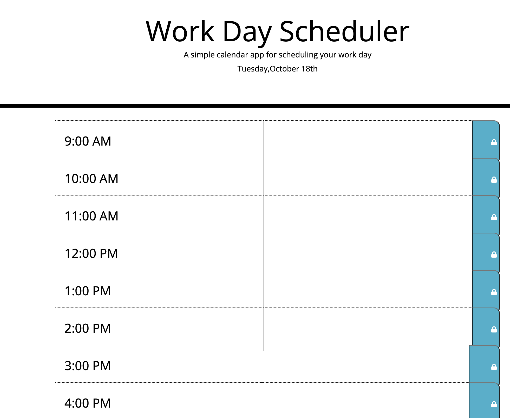

# Calendar.WorkDay

## User Story 

As an employee with a busy schedule I want to add important events to a daily planner, so that I can manage my time effectively.

## Installation

The following tools were used for the development and testing of this project. Web Browser (Google Chrome preferred) Code development IDE (Microsoft VS Code)

## Usage 

As a user, I want to record my daily activities on the day scheduler and access those tasks when I reload the page. 

## Link

Link to Deployed Application: https://cinyp.github.io/Calendar.WorkDay/ 
Link to Repo: https://github.com/CinYP/Calendar.WorkDay

## Credits

Development team:Cinthia Pruitt. Georgia Tech Coding Bootcamp instructors, TA's, tutoring staff, and other faculty. 

## License

Not applicable

## Problems

Unsure if working. 
